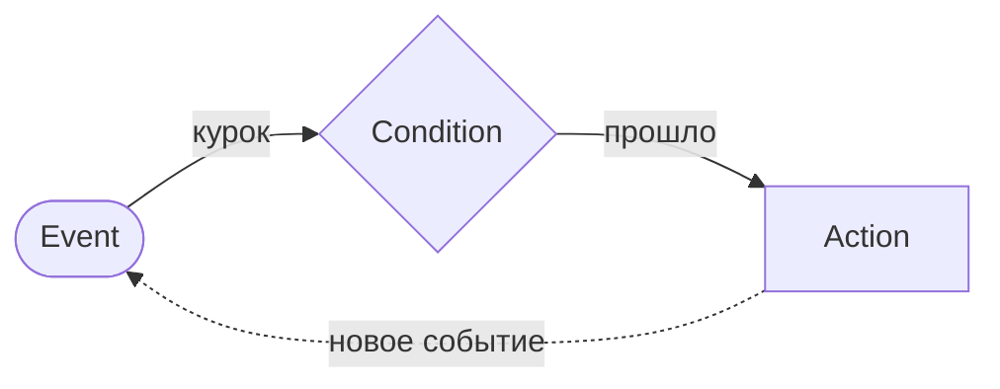
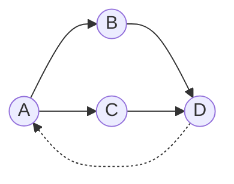
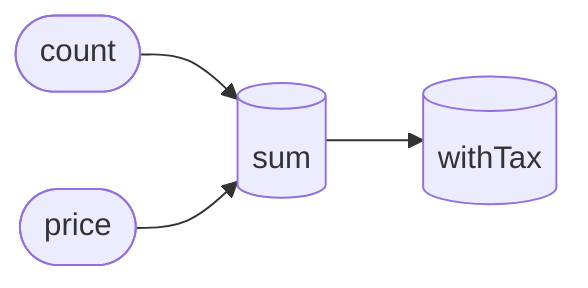
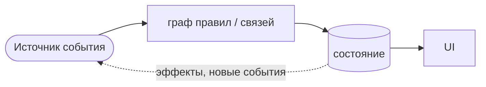
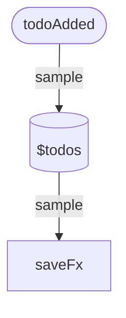

<div class="flex justify-center mb-5">
  <span class="px-3 py-1 rounded-full text-xs font-bold tracking-widest uppercase bg-yellow-300 text-black">MoscowJS #71</span>
</div>

# Кинетический манифест

Event-driven подход к состоянию и чем его реализуют — от KRL до Effector

<!--
🗣 Привет! Меня зовут Илья, и это «Кинетический манифест». Сегодня — про управление состоянием. Но не «какой стейт-менеджер выбрать», а про кое-что важнее — про мировоззрение, через которое мы смотрим на данные. Слово «кинетика» я взял не с потолка — оно из языка 2008 года, к нему дойдём.

⏱ ~30s · задать главный тезис, не частить
-->

---
layout: image-right
image: /holy_2025.jpg
---

# About

**[Оловянников Илья]** — *[MoscowJS]*

- [Effector Community Member];
- [MoscowJS организатор];
- [Батя].


<!--
🗣 Коротко о себе: [имя, роль]. Контрибьючу в Effector, помогаю с MoscowJS, и ещё — батя. Рассказываю не потому, что «топлю» за Effector: я сам прошёл путь от императива к декларативу, и в какой-то момент щёлкнуло. Вот этим переходом и делюсь.

⏱ ~25s · одна история, не резюме
-->

---

# План доклада

<div class="flex flex-col gap-3 mt-6 text-base">
<v-clicks>
<v-click>
<div class="flex items-center gap-4">
  <div class="text-3xl text-[#fe6801]"><carbon:idea /></div>
  <div><b>Что такое кинетический подход</b> <span class="opacity-60">— концепт: события, связи, реактивность; корни в KRL</span></div>
</div></v-click>

<v-click>
<div class="flex items-center gap-4">
  <div class="text-3xl text-sky-400"><carbon:flow /></div>
  <div><b>Как это реализуют</b> <span class="opacity-60">— Effector как пример + соседи: RxJS, XState, signals</span></div>
</div>
</v-click>
<div class="flex items-center gap-4">
  <div class="text-3xl text-violet-400"><carbon:trophy /></div>
  <div><b>Чем подход выигрывает</b> <span class="opacity-60">— race conditions, логика ≠ UI, тесты и SSR</span></div>
</div>
<v-click>

<div class="flex items-center gap-4">
  <div class="text-3xl text-amber-400"><ph:scales-bold /></div>
  <div><b>Trade-offs</b> <span class="opacity-60">— когда стоит, когда overkill, и какая цена</span></div>
</div>
</v-click>
</v-clicks>

</div>

<!--
🗣 План: сначала — что такое кинетический подход (концепт). Потом — как его реализуют, на примере Effector и соседей. Потом — чем он выигрывает. И обязательно честно — про trade-offs, когда он не нужен. Первые две трети — про подход, Effector просто удобный пример.

⏱ ~25s
-->

---
layout: center
class: text-center
---

# Вопрос залу 🙋

<div class="text-3xl leading-snug mt-8 max-w-3xl mx-auto">
Согласны, что <b class="text-[#ff9243]">веб — событийно-ориентированная</b> среда?
</div>

<div class="flex justify-center gap-5 mt-12 text-lg">
  <span class="px-5 py-2 rounded-full border border-[#fe6801] bg-[#fe6801]/10">✋ Да, конечно</span>
  <span class="px-5 py-2 rounded-full border border-gray-400/30">🤔 Не уверен / нет</span>
</div>

<div class="opacity-60 mt-10 text-sm">Поднимите руку — пригодится в следующие 10 минут</div>

<!--
🗣 Но сначала — вопрос вам. Поднимите руку: кто согласен, что веб — это событийно-ориентированная среда? … Вижу. А кто не уверен или не согласен? … Запомните свою руку — вернёмся к этому в конце.

⏱ ~30s · ИНТЕРАКТИВ: реально жди поднятые руки, прикинь расклад
-->

---
transition: fade-out
---

# Данные больше не статичны

Веб 2000-х: «загрузил страницу — увидел снимок данных».
Веб сегодня: данные **текут** непрерывно.

<v-clicks>

- 🔌 **WebSocket / SSE** — сервер пушит изменения
- 👥 **Коллаборативность** (Figma, доки) — несколько источников правды сразу
- ⌨️ **Поток ввода** — печать, скролл, drag, геолокация
- ⚡ **Оптимистичные апдейты, гонки запросов, отмена**

</v-clicks>

<v-click>

<div class="mt-10 p-4 border-l-4 border-[#fe6801] bg-[#fe6801]/10">
Если данные постоянно в движении — почему мы пишем код так, будто состояние стоит на месте и мы его «обновляем командами»?
</div>

</v-click>

<!--
🗣 Веб двухтысячных — «загрузил страницу, получил снимок данных». Сегодня данные текут непрерывно: сокеты пушат изменения, в Figma несколько людей правят одно и то же, пользователь печатает и скроллит — это потоки; плюс оптимистичные апдейты, гонки, отмены. И вопрос, который повиснет до конца: если данные в постоянном движении — почему мы пишем код так, будто состояние стоит на месте?

⏱ ~50s · по пунктам кликами; финальный вопрос НЕ отвечаю
-->

---
layout: section
---

<div class="text-7xl text-rose-400 opacity-80 mb-4"><ph:warning-bold /></div>

# Проблема
## Почему императивный код не масштабируется

<!--
🗣 И тут начинается проблема. Я пришёл к ней не из теории — через эволюцию обычного проекта.

⏱ ~15s · смена тона: контекст кончился, началась боль
-->

---
layout: two-cols
layoutClass: gap-6
---

# Как растёт императивный код

```tsx {all|2-4|6-11|13-16}
function SearchUsers() {
  const [q, setQ] = useState('')
  const [users, setUsers] = useState([])
  const [loading, setLoading] = useState(false)

  // добавили «живой поиск»
  useEffect(() => {
    if (q.length < 2) return
    // ответы приходят вразнобой
    api.search(q).then(setUsers)
  }, [q])

  // та же логика из формы — продублирована
  async function onSubmit() {
    setUsers(await api.search(q))
  }
}
```

::right::

<div class="pt-14">

<v-clicks>

- 🧩 **Логика прибита к компоненту** — внутри `useEffect` и обработчика
- 🌀 **Гонка**: ответы приходят не по порядку — старый затирает свежий
- ♻️ **Второй триггер → дублирование**: форма повторяет эффект
- 🧪 **Не протестировать** без рендера и моков таймеров

</v-clicks>

<v-click>

<div class="mt-6 text-[#ff9243] text-sm">
Чем больше триггеров и async — тем хуже. Корень: логика связана с компонентом и порядком выполнения.
</div>

</v-click>

</div>

<!--
🗣 Реальный компонент — поиск пользователей. Начинался просто, пара useState. Попросили «живой поиск» — добавили useEffect, дёргаем API на каждый ввод. Первая беда: ответы приходят не по порядку — запрос на «an» вернётся позже, чем на «anna», и затрёт свежий результат старым. Потом понадобился сабмит — продублировали ту же логику. А ещё это надо тестировать, но логика внутри компонента. Корень боли: логика прибита к компоненту и к порядку выполнения.

⏱ ~80s · «вы это писали» — узнавание; разбирать по кликам
-->

---

# До / После

<div class="grid grid-cols-2 gap-4">

<div>
<div class="text-xs mb-1 opacity-60">❌ Императивно — логика прибита к UI</div>

```tsx {7,11}
function SearchUsers() {
  const [q, setQ] = useState('')
  const [users, setUsers] = useState([])

  useEffect(() => {
    if (q.length < 2) return
    api.search(q).then(setUsers)   // гонка
  }, [q])

  async function onSubmit() {
    setUsers(await api.search(q))  // дубль
  }
}
```

</div>

<div>
<div class="text-xs mb-1 opacity-60">✅ Кинетически — граф решает порядок</div>

```ts {5-9}
const searchUsers = createEvent<string>()
const $users = createStore<User[]>([])
const searchFx = createEffect(api.search)

sample({
  clock: searchUsers,
  filter: (q) => q.length >= 2,
  target: searchFx,
})
$users.on(searchFx.doneData, (_, u) => u)
```

</div>

</div>

<v-click>

<div class="mt-5 text-center text-sm text-[#ff9243]">
Слева — <b>как</b> выполнить. Справа — <b>когда</b> и <b>откуда</b>. Гонка исчезла не магией — снимок берётся атомарно.
</div>

</v-click>

<!--
🗣 Вот то же самое — до и после. Слева императивный компонент: useEffect, onSubmit — подсвечены две болевые строки: гонка и дубль. Справа Effector: событие, стор, эффект и один sample. Гонка исчезла не потому что «Effector лучше», а потому что sample берёт значение в один тик — зазора для дрейфа нет. Кода примерно столько же, но он описывает связи, а не шаги.

⏱ ~60s · дать сравнить; спросить «где гонка? — нигде»
-->

---

# Два мировоззрения

<div class="text-sm opacity-90 mb-3">
Корень боли: <b>императив диктует «как»</b> (порядок шагов), а <b>декларатив описывает «что»</b> (связи). Отсюда два мировоззрения:
</div>

<div class="text-sm">

| | **Дискретное / императивное** | **Кинетическое / декларативное** |
|---|-------------------------------|---|
| Состояние | снапшот, который ты мутируешь | поток через граф связей |
| Ты пишешь | **порядок действий**          | **связи**: «когда X — следует Y» |
| Событие | повод вызвать обработчик      | факт, что сам находит свои правила |
| Логика | размазана по компонентам      | в модели, отдельно от UI |
| Примеры | Redux, Zustand, `useState`              | Effector, RxJS, XState, signals |

</div>

<v-click>

<div class="mt-8 p-4 border-l-4 border-amber-400 bg-amber-400/5 text-sm">
<b>Дисклеймер:</b> дискретный подход — не «плохой». Для половины задач он честнее и проще.
Доклад не про «выбросьте useState», а про то, <b>когда и почему</b> второй взгляд мощнее. К trade-offs вернёмся.
</div>

</v-click>

<!--
🗣 Корень глубже. Есть два способа писать. Императивный — ты диктуешь КАК: возьми, проверь, положи, по шагам. Декларативный — ты описываешь ЧТО: какие между данными связи, а порядок вычислит система. Эта таблица — водораздел. И сразу честно: императивный подход не плохой, для половины задач он проще. Доклад не про «выбросьте useState» — про то, КОГДА и ПОЧЕМУ второй взгляд мощнее.

⏱ ~60s · 🔴 дисклеймер про useState — ВСЛУХ и с нажимом
-->

---
layout: section
---

<div class="text-7xl text-[#fe6801] opacity-80 mb-4"><carbon:idea /></div>

# Часть 1
## Что такое кинетический подход

<!--
🗣 Часть первая — что вообще такое этот кинетический подход. Без кода, чистый концепт.

⏱ ~8s
-->

---

# Что такое «кинетика»?

<div class="text-sm opacity-90 mb-3">
Греч. <i>kinētikos</i> — «относящийся к движению» (κίνησις — движение). В классической механике движение описывают три раздела:
</div>

<div class="grid grid-cols-3 gap-3 text-sm">

<div class="p-3 border border-gray-400/20 rounded">
<b>Статика</b><br/><span class="opacity-70">равновесие тел — силы <b>без движения</b></span>
</div>

<div class="p-3 border border-gray-400/20 rounded">
<b>Кинематика</b><br/><span class="opacity-70">геометрия движения (траектория, скорость) — <b>без причин</b></span>
</div>

<div class="p-3 border border-gray-400/20 rounded">
<b>Динамика</b><br/><span class="opacity-70">движение <b>с учётом сил и масс</b> (законы Ньютона)</span>
</div>

</div>

<div class="mt-3 p-2 border-l-4 border-rose-400 bg-rose-400/5 text-xs">
Строго говоря, «кинетики» как раздела механики в русской традиции нет. Термин живёт в другом:
</div>

<div class="text-sm mt-3">

- **Физическая кинетика** — статфизика: неравновесные процессы и перенос (диффузия, теплопроводность), уравнение Больцмана
- **Химическая кинетика** — скорости реакций и их механизмы
- **Англ. _kinetics_** — часть динамики о связи сил и движения (≈ рус. «динамика») → вероятный источник «kinetic» в KRL

</div>

<v-click>

<div class="mt-4 text-center text-[#ff9243]">
🔑 Общий знаменатель: кинетика — про <b>скорость и эволюцию процессов во времени</b>, а не про статичное состояние.
</div>

</v-click>

<!--
🗣 Сначала закроем термин — честно. «Кинетика», греч. kinētikos — «относящийся к движению». В механике движение описывают статика, кинематика, динамика — и строгого раздела «кинетика» там нет. Термин живёт в другом: физическая кинетика — про неравновесные процессы, химическая — про скорости реакций. Общий знаменатель: про скорость и эволюцию процессов во времени, а не про статичный снимок.

⏱ ~50s · обезоружить придиру; не углубляться в физику
-->

---

# Кинетика как метафора

<div class="text-sm opacity-90 mb-3">
В стейт-менеджменте «кинетика» — не из учебника физики (это <b>имя из KRL</b>), а <b>метафора</b>. Берём её за то, что в ней ценно:
</div>

<table>
<thead>
<tr><th>Физическая интуиция</th><th>В управлении состоянием</th></tr>
</thead>
<tbody>
<v-clicks>
<tr><td><b>Импульс</b> (толкнули)</td><td><b>Event</b> — клик, ввод, сообщение из сокета</td></tr>
<tr><td><b>Траектория</b></td><td>путь данных через граф правил</td></tr>
<tr><td><b>Препятствие</b></td><td>условие / фильтр — пропустить или нет</td></tr>
<tr><td><b>Результат движения</b></td><td>эффект: запрос, запись, уведомление</td></tr>
</v-clicks>
</tbody>
</table>

<v-click>

<div class="mt-6 text-center text-[#ff9243]">
Состояние — не «точка», а <b>траектория</b> в графе. <br/> У данных есть динамика – откуда они пришли, какими стали и куда идут.
</div>

</v-click>

<!--
🗣 В стейт-менеджменте «кинетика» — метафора (и имя из KRL). И рабочая: импульс — это событие, траектория — путь через граф, трение — debounce и throttle, препятствие — фильтр, результат — эффект. Главный сдвиг: состояние не точка, а траектория. Строишь русло, а не таскаешь воду вёдрами.

⏱ ~45s
-->

---

# KRL — язык для «Живого Веба»
## Kinetic Rule Language

<div class="grid grid-cols-2 gap-6 mt-2 text-sm">

<div>

**Что это**
- Правило-ориентированный язык, **2007–2008**
- Программа = набор **правил** (rulesets), реагирующих на события
- Часть движка **KRE** (Kinetic Rules Engine), open-source

**Кто создал**
- **Фил Виндли** (Phil Windley), компания **Kynetx**
- Эпоха Twitter / iPhone / открытых API — веб стал реактивным

</div>

<div>

**Главная идея**

> Веб — это не страницы, это **потоки событий**.

Каждый пользователь — «**personal cloud**»: облако правил, реагирующих на события его жизни. Три кита:

- 🆔 **Entity orientation** — правила работают *от имени сущности* (юзер, устройство)
- 🔗 **Event binding** — связывают *паттерны событий* с *действиями*
- 💾 **Persistent values** — у правил своя «память» без БД

</div>

</div>

<!--
🗣 Откуда «кинетика» в коде? 2008 год, Фил Виндли, Kynetx, язык KRL — Kinetic Rule Language — для «Живого Веба». Идея манифеста: веб — это не страницы, это потоки событий. Каждый пользователь — облако правил. Ключевое слово salience: событие не адресовано коду, оно поднимается, а правило само на него подписано. Прямой предок инверсии контроля. Идее почти 20 лет.

⏱ ~50s
-->


---

# ECA — сердце KRL

Каждое правило KRL устроено как **ECA (Event–Condition–Action)**:

```js {all|2|3|4}
rule good_morning {
  select when pageview url #example.com#   // EVENT: что случилось
  if morning() then                         // CONDITION: проверка
  notify("Welcome!", "Good morning!")       // ACTION: реакция
}
```

<div class="grid grid-cols-2 gap-6 mt-4 items-center">

<div>



</div>

<div class="text-sm">
Вот он, наш первый граф.<br/> <b class="text-[#ff9243]">Узлы</b> — событие, условие, действие;<br/> <b class="text-[#ff9243]">рёбра</b> — что за чем следует.<br/><br/>
Правило — путь <b>Event → Condition → Action</b>.<br/><br/> Не прошло условие — правило молчит. <br/><br/>А действие рождает новое событие → <br/>правила сцепляются в <b>граф</b>.
</div>

</div>

<v-click>

<div class="mt-5 text-sm opacity-80 text-center">
Тот же ECA лежит под Effector (<code>event → filter → target</code>), под reducer'ами, под стейт-машинами. Подходу почти 20 лет.
</div>

</v-click>

<!--
🗣 Как устроено правило? ECA: Event — Condition — Action. Событие — курок, без него ничего. Условие — предохранитель: не прошло — правило молчит, без «иначе». Действие — пуля. А теперь — наш первый граф по делу: узлы это событие, условие, действие, правило — путь по нему. И вот это пунктирное ребро — главное: действие поднимает новое событие, и правила сцепляются в граф. Запомните картинку — скоро увидим, как код её собирает. 

⏱ ~60s · граф уже определён на прошлом слайде — тут только показываю; пауза после «запомните»
-->

---
layout: two-cols
layoutClass: gap-8
---

# Что такое граф?

<div class="text-sm leading-relaxed">

Мы уже пару раз сказали «граф». Это всего две вещи:

- 🔵 **Узлы** (вершины) — «штуки»
- ➡️ **Рёбра** — связи между ними

Есть направление (стрелки) → граф **направленный**: связь идёт в одну сторону. Ребро может вести и назад — это **обратная связь** (цикл).

</div>

<v-click>

<div class="mt-6 p-3 border-l-4 border-[#fe6801] bg-[#fe6801]/10 text-sm">
У нас: узлы — <b>события, состояния, эффекты</b>; рёбра — <b>связи</b>. Данные текут по стрелкам — мы лишь задаём русло.
</div>

</v-click>

::right::

<div class="pt-12">



<div class="text-center text-xs opacity-60 mt-3">
4 узла · рёбра со стрелками · пунктир — обратная связь
</div>

</div>

<!--
фундаментальные структуры данных, которые моделируют связи и отношения между объектами

🗣 Мы уже пару раз сказали «граф» — давайте честно, что это. Всего две вещи: узлы — это «штуки», и рёбра — связи между ними. Если у рёбер есть направление — граф направленный: связь идёт в одну сторону, а иногда возвращается назад, это обратная связь. Всё. В нашем случае узлы — это события, состояния и эффекты, рёбра — связи между ними. И ключевое: данные сами текут по стрелкам, мы только задаём русло. Дальше мы такие графы и будем рисовать.

⏱ ~40s · показать пальцем: вот узел, вот ребро, вот стрелка-направление
-->

---

# Три столпа подхода

<div class="grid grid-cols-3 gap-4 mt-6">

<div v-click class="p-4 border border-[#fe6801]/40 rounded bg-[#fe6801]/10">
<div class="text-[#ff9243] font-bold mb-2">1. Event-driven</div>
Уведомление, а не команда.<br/><br/>
<span class="opacity-70 text-sm">
Императив: «Сделай!»<br/>
Вопрос: «Сделаешь ли?»<br/>
<b>Event: «Это случилось».</b><br/><br/>
Событие не знает, кто отреагирует → слабая связанность.
</span>
</div>

<div v-click class="p-4 border border-sky-400/30 rounded bg-sky-400/5">
<div class="text-sky-300 font-bold mb-2">2. Declarative</div>
Связи вместо порядка.<br/><br/>
<span class="opacity-70 text-sm">
Ты не пишешь «сначала А, потом Б».<br/><br/>
Ты объявляешь: «Б зависит от А».<br/><br/>
Порядок вычислит граф.
</span>
</div>

<div v-click class="p-4 border border-violet-400/30 rounded bg-violet-400/5">
<div class="text-violet-300 font-bold mb-2">3. Reactivity</div>
Граф пересчитывается сам.<br/><br/>
<span class="opacity-70 text-sm">
Изменился источник →<br/>
производные обновились автоматически,<br/>
в один тик,<br/>
без ручных вызовов.
</span>
</div>

</div>

<v-click>

<div class="mt-6 text-center text-sm opacity-80">
Эти три вещи делают подход «кинетическим» — <b>независимо от библиотеки</b>.
</div>

</v-click>

<!--
🗣 Соберём в три столпа — это про подход, не про библиотеку. Первое — event-driven: не «сделай», а «это случилось»; событие не знает, кто отреагирует. Второе — декларативность: не «сначала А, потом Б», а «Б зависит от А». Третье — реактивность: поменялся источник — зависимые пересчитались сами, в один тик. Эти три вещи вместе и делают подход кинетическим.

⏱ ~60s
-->

---
layout: two-cols
layoutClass: gap-8
---

# Что такое реактивность?

<div class="text-sm leading-relaxed">

Меняешь **источник** — всё зависимое **пересчитывается само**.

</div>

<div class="mt-4 text-sm">

<div class="p-2 border-l-4 border-gray-400/30 mb-2">
<b>Императивно:</b> поменял <code>count</code> — не забудь дёрнуть <code>updateSum()</code>, <code>updateTax()</code>… забыл — баг.
</div>

<div v-click class="p-2 border-l-4 border-[#fe6801] bg-[#fe6801]/10">
<b>Реактивно:</b> один раз объявил <code>sum = count × price</code> — дальше оно само.
</div>

</div>

<v-click>

<div class="mt-4 text-[#ff9243] text-sm">
Это тот же граф: меняется узел — изменение бежит по рёбрам к зависимым. 
</div>

</v-click>

::right::

<div class="pt-10">



<div class="text-center text-xs opacity-60 mt-3">
меняем <b>count</b> → <b>sum</b> пересчитался → <b>withTax</b> пересчитался
</div>

</div>

<!--
Реактивность – способность системы реагировать на изменения данных

🗣 Что такое реактивность — тоже одной фразой. Ты меняешь источник, и всё, что от него зависит, пересчитывается само. Императивно: поменял количество — будь добр вручную позвать пересчёт суммы, потом налога; забыл звено — поймал баг. Реактивно: ты один раз объявил, что сумма равна количеству на цену, — и дальше оно само. И это ровно тот же граф, что мы только что рисовали: меняется узел — изменение бежит по рёбрам к зависимым.

⏱ ~40s · опереться на граф с прошлых слайдов
-->

---

# Реактивность — не изобретение фронтенда

Идея «данные движутся сами» старше React лет на тридцать.

<div class="text-sm">

| Год | Технология | Реактивность |
|---|---|---|
| 1979 | VisiCalc / Excel | `=A1+B1` пересчитывается при изменении ячеек |
| 1995 | Delphi / VB | data-binding: UI привязан к переменным |
| 2010 | Knockout / Ember | observable, уведомления об изменениях |
| 2013 | React | перерисовка дерева при смене стейта |
| 2015 | MobX | прозрачная реактивность («магия») |
| 2018 | Effector | реактивность через **явный** граф |
| 2020+ | Solid / Signals | fine-grained: обновляется только нужный узел |

</div>

<v-click>

<div class="mt-4 text-center text-[#ff9243]">
Это не мода. Меняется только, <b>насколько явно</b> мы видим граф в коде.
</div>

</v-click>

<!--
🗣 Реактивность не фронтенд придумал. =A1+B1 в Excel — это она, 1979 год. Потом дата-байндинги, MobX с «магией», Effector с явным графом, сигналы. Сорок лет одна линия — меняется только, насколько ЯВНО мы видим граф.

⏱ ~40s · при отставании — свернуть в одну фразу
-->

---
layout: section
---

<div class="text-7xl text-sky-400 opacity-80 mb-4"><carbon:flow /></div>

# Часть 2
## Как это реализуют — карта примитивов

<!--
🗣 И вот про это «насколько явно» — вторая часть: как подход реализуют.

⏱ ~8s
-->

---

# Общая модель любой реализации



<div class="text-xs mt-1">

| Роль | Effector | RxJS | Redux | Signals |
|---|---|---|---|---|
| Событие / намерение | `event` | `Subject` | `action` | вызов сеттера |
| Состояние | `store` (`$`) | `BehaviorSubject` | `reducer` state | `signal` |
| Производное | `combine` / `.map` | `combineLatest` | `selector` | `computed` |
| Связь / правило | `sample` | операторы `pipe` | `middleware` / saga | автозависимость |
| Сайд-эффект | `effect` | оператор + subscribe | thunk / saga | `effect` |

</div>

<v-click>

<div class="mt-2 text-center text-[#ff9243] text-sm">
Примитивы разные — подход один. Дальше код на Effector, но мысль переносится на любую строку.
</div>

</v-click>

<!--
🗣 Под всеми библиотеками — одна схема: событие летит в граф, граф меняет состояние, состояние рисует UI, эффекты возвращаются обратно. И один набор кирпичей, как ни назови: событие, состояние, производное, связь, эффект. В Effector — event и store, в RxJS — Subject, в Redux — экшен и редьюсер, в сигналах — signal. Примитивы разные — подход один.

⏱ ~50s · таблицу ч итать по строкам (по ролям)
-->

---
layout: two-cols
layoutClass: gap-6
---

# Effector — явный граф

Все связи **записаны в коде** — и складываются в граф:

```ts {all|1-3|5-11|13-14}
const todoAdded = createEvent<string>()  // событие
const $todos = createStore<Todo[]>([])   // состояние
const saveFx = createEffect(saveTodos)   // эффект

sample({                  // правило (ECA)
  clock: todoAdded,       // когда
  source: $todos,         // взять
  filter: Boolean,        // если
  fn: addTodo,            // преобразовать
  target: $todos,         // положить
})

// автосохранение
sample({ clock: $todos, target: saveFx }) 
```

::right::

<div class="pt-6">



<v-click>

<div class="text-sm mt-4">
Код слева <b>строит этот граф</b>: юниты — <b class="text-[#ff9243]">узлы</b>, <code>sample</code> — <b class="text-[#ff9243]">рёбра</b>.<br/> Данные бегут по рёбрам, а не вызываются вручную.
</div>

</v-click>

</div>

<!--
🗣 Вот Effector. Три юнита: событие todoAdded, стор $todos, эффект saveFx. Дальше sample — читается как ECA: когда todoAdded, если текст непустой, взять $todos, преобразовать, положить обратно. Второй sample: изменение $todos — автосохранение. А справа — тот самый граф: юниты это узлы, sample это рёбра. Код не выполняется по шагам — он один раз строит граф, дальше данные сами бегут по рёбрам. Компонент про логику не знает — только дёргает todoAdded.

⏱ ~80s · sample прочитать вслух как предложение; показать на граф справа
-->

---

# Соседи по подходу

Кинетика ≠ Effector. Тот же подход, разные акценты — каждая делает явным **своё**:

<div class="grid grid-cols-2 gap-4 mt-4">

<div v-click class="p-3 border border-gray-400/20 rounded">
<b class="text-[#ff9243]"><ph:wave-sine-bold class="inline" /> RxJS</b> — явные <b>потоки</b>.<br/>
<span class="text-sm opacity-70">Мощная асинхронная композиция; кривая обучения крутая.</span>
</div>

<div v-click class="p-3 border border-gray-400/20 rounded">
<b class="text-sky-300"><ph:circles-three-bold class="inline" /> XState</b> — явные <b>режимы</b>.<br/>
<span class="text-sm opacity-70">Когда важно «в каком состоянии находится фича».</span>
</div>

<div v-click class="p-3 border border-gray-400/20 rounded">
<b class="text-violet-300"><ph:lightning-bold class="inline" /> MobX / Solid / Signals</b> — fine-grained.<br/>
<span class="text-sm opacity-70">Минимум кода, «магия» автозависимостей.</span>
</div>

<div v-click class="p-3 border border-gray-400/20 rounded">
<b class="text-amber-300"><ph:stack-bold class="inline" /> Redux-Saga / -Observable</b> — слой <b>эффектов</b>.<br/>
<span class="text-sm opacity-70">Кинетика поверх дискретного Redux.</span>
</div>

</div>

<v-click>

<div class="mt-6 text-center text-[#ff9243]">
Выбор библиотеки = выбор того, <b>что сделать явным</b>: граф / потоки / режимы / вычисления.
</div>

</v-click>

<!--
🗣 Это не «Effector против всех». Тот же подход у соседей, каждый делает явным своё: RxJS — потоки, XState — режимы, MobX/Solid/сигналы — мелкогранулярную реактивность, Redux-Saga — слой эффектов. Выбор библиотеки = выбор, ЧТО сделать явным: граф, потоки, режимы или вычисления.

⏱ ~40s
-->

---
layout: section
---

<div class="text-7xl text-violet-400 opacity-80 mb-4"><carbon:trophy /></div>

# Часть 3
## Чем подход реально выигрывает

<!--
🗣 Концепт ясен. Часть третья — а что я с этого имею? Три выигрыша.

⏱ ~8s
-->

---

# Выигрыш 1 — смерть race conditions

<div class="grid grid-cols-2 gap-4">

<div>

**Императивно:** между `await` состояние «уезжает»

```ts {all|2|3|4}
async function checkout() {
  const cart = await getCart()  // ждём…
  const user = globalUser       // а если сменился?
  api.buy(cart, user)           // что сейчас — ???
}
```

</div>

<div>

**Кинетически:** значения берутся в один тик

```ts {all|3|4}
sample({
  clock: checkoutPressed,
  source: { cart: $cart, user: $user },
  filter: $isAuthorized,
  target: buyFx,
})
```

</div>

</div>

<v-click>

<div class="mt-8 p-4 border-l-4 border-[#fe6801] bg-[#fe6801]/10">
Нет зазора для «дрейфа состояния» — снимок берётся атомарно. То же в RxJS через <code>withLatestFrom</code>: это свойство <b>подхода</b>, а не одной библиотеки.
</div>

</v-click>

<!--
🗣 Первое — помните гонку из SearchUsers? Вот как лечится. Слева императив: между двумя await состояние «уехало» — пока ждали, пользователь сменился, покупаешь не то. Справа кинетически: sample берёт значения в момент срабатывания, в один тик, атомарно — нет зазора, нет дрейфа. И это не магия Effector: в RxJS withLatestFrom делает то же. Свойство подхода.

⏱ ~70s · 🔁 callback к слайду «Как растёт императивный код»
-->

---
layout: two-cols
layoutClass: gap-8
---

# Выигрыш 2 — логика отделена от UI

<div class="p-3 border border-sky-400/30 rounded bg-sky-400/5 mb-4">
<b class="text-sky-300">UI</b><br/>
Только генерирует события<br/>и отображает состояние.<br/><br/>
<span class="opacity-70 text-sm">Не знает про бизнес-логику и сайд-эффекты.</span>
</div>

<div class="p-3 border border-violet-400/30 rounded bg-violet-400/5">
<b class="text-violet-300">Модель</b><br/>
события → связи → состояние → эффекты.<br/><br/>
<span class="opacity-70 text-sm">Живёт без React/Vue.</span>
</div>

::right::

<div class="pt-16">

<v-clicks>

- Модель **тестируется без рендера**
- Переносится между фреймворками
- Компонент становится **тонким**

</v-clicks>

<v-click>

```tsx
// весь компонент:
const onClick = useUnit(todoAdded)
<button onClick={() => onClick(text)}>
  Добавить
</button>
```

</v-click>

</div>

<!--
🗣 Второе — разделение. UI только генерирует события и показывает состояние, вся логика в модели, которая живёт без React и Vue. Модель тестируется без рендера, переносится между фреймворками, компонент тонкий — вот он весь. Для тимлида: модель переживёт миграцию UI-фреймворка.

⏱ ~45s
-->

---

# Выигрыш 3 — изоляция для SSR и тестов

Глобальное состояние ломается на сервере: один процесс — много запросов.
Кинетические библиотеки дают изолированный экземпляр графа. В Effector — `fork()`:

```ts {all|2|3|4}
// тест без мока React: дёрнули событие — проверили состояние
const scope = fork()
await allSettled(todoAdded, { scope, params: 'Test' })
expect(scope.getState($todos)).toHaveLength(1)
```

<v-click>

<div class="mt-8 p-4 border-l-4 border-[#fe6801] bg-[#fe6801]/10">
Тот же механизм работает на сервере: <b>скоуп на каждый запрос</b> → нет утечки состояния между пользователями.
</div>

</v-click>

<!--
🗣 Третье — изоляция. Глобальный стор на сервере течёт между запросами разных юзеров. fork даёт изолированный граф: на сервере один на запрос, в тесте один на тест. Дёрнул событие, проверил состояние — без рендера и моков. Тестируемость из самой архитектуры, бесплатно.

⏱ ~40s
-->

---
layout: section
---

<div class="text-7xl text-amber-400 opacity-80 mb-4"><ph:scales-bold /></div>

# Часть 4
## Trade-offs: когда стоит и когда НЕ стоит

<div class="text-sm opacity-60 mt-2">Самая честная часть. Без неё доклад — реклама.</div>

<!--
🗣 А теперь самая честная часть. Без неё доклад был бы рекламой.

⏱ ~8s · сменить тон на взвешенный, не торопиться
-->

---
layout: two-cols
layoutClass: gap-8
---

# ✅ Когда окупается

<v-clicks>

- **Много асинхронности и гонок** — параллельные запросы, отмена, оптимистичные апдейты
- **Real-time / потоки** — сокеты, коллаборативность, живые данные
- **Сложные зависимости** между кусками состояния
- **Логику нужно тестировать** отдельно от UI
- **Большая команда / долгий проект** — явные связи дешевле в поддержке

</v-clicks>

::right::

# ⛔ Когда overkill

<v-click>

- **Маленькое приложение / локальный стейт** — `useState` честнее
- **Прототип / MVP** — скорость важнее архитектуры
- **Состояние в основном серверное** — часто хватает TanStack Query

</v-click>
<v-click>

- **Команда не готова** к смене мышления — кривая обучения реальна

</v-click>

<v-click>

<div class="mt-6 text-sm text-[#ff9243]">
Это инвестиция в сложность данных. Нет сложности — нет окупаемости.
</div>

</v-click>

<!--
🗣 Когда окупается: много асинхронности и гонок, real-time и потоки, сложные зависимости, нужно тестировать логику, проект и команда надолго. Узнали свой проект — берите.
А когда overkill: маленькое приложение и локальный стейт — useState честнее; прототип — скорость важнее; состояние серверное — часто хватает TanStack Query; команда не готова к смене мышления. Главное: кинетика — инвестиция в сложность данных. Нет сложности — нет окупаемости.

⏱ ~70s (обе колонки) · честно признать: сам на мелочи беру useState
-->

---
class: flex flex-col
---

# Цена, о которой молчат

<div class="flex-1 flex items-center">
<div class="grid grid-cols-3 gap-5 w-full">
<v-clicks>

<div class="p-5 rounded-xl border border-rose-400/30 bg-rose-400/5">
  <div class="flex items-center gap-3 mb-2">
    <div class="text-3xl text-rose-400"><carbon:debug /></div>
    <div class="font-bold text-lg">Дебаг графа</div>
  </div>
  <div class="text-sm opacity-80">«Откуда прилетело это обновление?» Изменение приходит издалека — без devtools трассировать больно.</div>
  <div class="mt-3 font-mono text-xs opacity-60">event → ? → ? → 💥 store</div>
</div>

<div class="p-5 rounded-xl border border-violet-400/30 bg-violet-400/5">
  <div class="flex items-center gap-3 mb-2">
    <div class="text-3xl text-violet-400"><ph:brain-bold /></div>
    <div class="font-bold text-lg">Порог входа</div>
  </div>
  <div class="text-sm opacity-80">Нужно перестроить мышление: с «команд» на <b>граф событий и связей</b>.</div>
  <div class="mt-3 font-mono text-xs opacity-60">императив → 🧠 → граф</div>
</div>

<div class="p-5 rounded-xl border border-sky-400/30 bg-sky-400/5">
  <div class="flex items-center gap-3 mb-2">
    <div class="text-3xl text-sky-400"><carbon:text-align-left /></div>
    <div class="font-bold text-lg">Линейность</div>
  </div>
  <div class="text-sm opacity-80">Императив читается <b>сверху вниз</b> — граф так не прочитать.</div>
  <div class="mt-3 font-mono text-xs opacity-60">1 → 2 → 3   vs   ┌─ graph ─┐</div>
</div>

</v-clicks>
</div>
</div>

<!--
🗣 И цена, о которой молчат. Граф тяжелее дебажить — «откуда прилетело обновление?»: изменение приходит издалека, через связи, без devtools трассировать больно. Есть и порог входа: надо перестроить мышление с команд на граф событий и связей. И иногда обычный код просто читается сверху вниз, а граф — нет.

⏱ ~40s · при отставании — одной фразой
-->
 
---
layout: center
class: text-center
---

# Помните вопрос в начале?

<div class="text-3xl leading-snug mt-6 max-w-3xl mx-auto">
«Веб — <b class="text-[#ff9243]">событийно-ориентированная</b> среда?»
</div>

<v-click>

<div class="text-xl opacity-80 mt-10 max-w-3xl mx-auto">
Если да — то и состояние логичнее вести <b>событиями</b>, а не командами.<br/>
Кинетический подход просто доводит это «да» до конца.
</div>

</v-click>

<!--
🗣 А теперь обещанное. Помните вопрос в начале — про событийный веб? Почти все подняли руки. Так вот: если среда событийная — то и состояние логичнее вести событиями, а не командами. Кинетический подход просто доводит это «да» до конца.

⏱ ~25s · callback к опросу
-->

---
layout: two-cols
layoutClass: gap-8
---

# Спасибо! 🙏

<div class="text-sm opacity-80 mb-2">Что унести с собой:</div>

<div class="text-sm leading-relaxed">

1. Состояние **движется**, а не лежит.
2. Подход = **три столпа**: события + связи + реактивность.
3. **Паттерн, а не библиотека** (ECA из KRL → Effector, RxJS, XState, signals).
4. Реализации различаются тем, **что делают явным**.
5. Выигрыши: нет race conditions, логика ≠ UI, тесты и SSR.
6. **Честно:** окупается на сложности; overkill на простом.

</div>

::right::

<div class="pt-6">

<div class="flex justify-center">


</div>

<div class="text-xs text-center opacity-70 mt-2">три столпа в одном цикле</div>

<div class="mt-6 flex justify-center gap-5 text-sm">
  <a href="https://en.wikipedia.org/wiki/Kinetic_Rule_Language" target="_blank">KRL</a>
  <a href="https://effector.dev/ru/introduction/core-concepts/" target="_blank">Effector</a>
  <a href="https://rxjs.dev/" target="_blank">RxJS</a>
  <a href="https://stately.ai/docs/xstate" target="_blank">XState</a>
</div>

<ul class="mt-4 ml-24 text-sm opacity-60">
  <li> Telegram [@olovyannikov_frontend]</li> <li> GitHub [/Olovyannikov]</li>
</ul>

</div>

<!--
🗣 Подытожим — шесть мыслей на вынос: состояние движется; три столпа — события, связи, реактивность; это паттерн, а не библиотека; реализации различаются тем, что делают явным; выигрыши — нет гонок, логика отделена от UI, тесты и SSR; и честно — окупается на сложности, лишний на простом. Спасибо! Ссылки и контакты на экране — готов к вопросам.

⏱ ~50s · пройтись по тезисам; на «Спасибо» — ссылки/контакты; пауза, вопросы
-->
