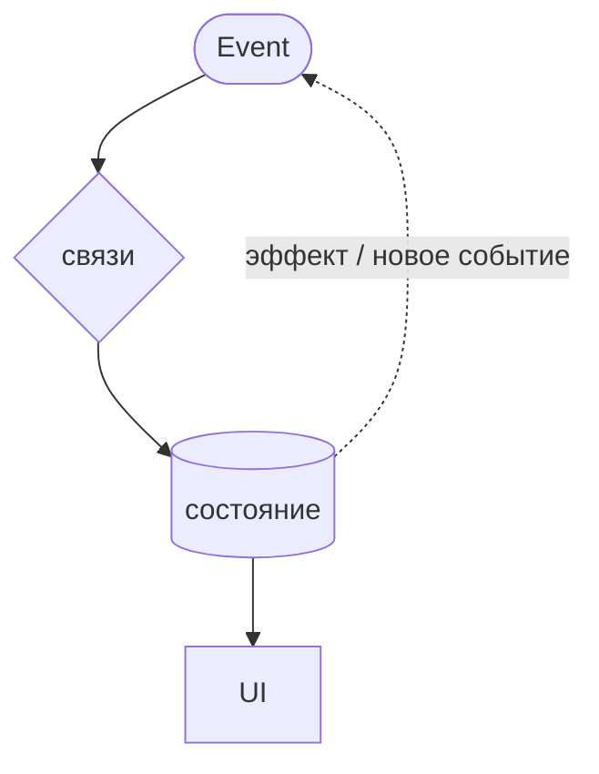

# Кинетический манифест

Event-driven подход к состоянию и чем его реализуют — от KRL до Effector

<div class="pt-12 opacity-70 text-sm">
  Термин «кинетика» — отсылка к <b>KRL</b> (Kinetic Rule Language, 2008), языку для «Живого Веба».<br/>
  Подход старше, чем кажется.
</div>

<div @click="$slidev.nav.next" class="mt-12 py-1" hover:bg="white op-10">
  Нажмите Space, чтобы начать <carbon:arrow-right />
</div>

<!--
**Открытие — задать главный тезис сразу.**

> Управление состоянием — это не выбор библиотеки, а выбор **мировоззрения**.

- Данные не лежат статично — они **движутся** через граф правил. Это и есть «кинетика».
- Слово «кинетика» — не маркетинг: оно из **KRL** (2008). К нему вернёмся.
- Цель доклада — показать **подход**; Effector лишь пример.

⏱ ~1 мин
-->

---
layout: intro
---

# О спикере

**[Имя Фамилия]** — *[Должность / Роль]*

- [Опыт: стек, годы, масштаб проектов]
- [Личная история: путь от императива к декларативу]

<div class="pt-8 text-sm opacity-75">
  Telegram <b>[@username]</b> · GitHub <b>[/username]</b> · [email]
</div>

<!--
**О себе — 30–40 сек, не больше.**

- Не зачитывать резюме.
- Рассказать **одну** историю: момент, когда «щёлкнуло» — переход от императива к декларативу.
- Задаёт доверие и тон всему докладу.

⏱ ~0.5 мин
-->

---
transition: fade-out
---

# Данные больше не статичны

Веб 2010-х: «загрузил страницу — увидел снимок данных».
Веб сегодня: данные **текут** непрерывно.

<v-clicks>

- 🔌 **WebSocket / SSE** — сервер пушит изменения
- 👥 **Коллаборативность** (Figma, доки) — несколько источников правды сразу
- ⌨️ **Поток ввода** — печать, скролл, drag, геолокация
- ⚡ **Оптимистичные апдейты, гонки запросов, отмена**

</v-clicks>

<v-click>

<div class="mt-10 p-4 border-l-4 border-teal-400 bg-teal-400/5">
Если данные постоянно в движении — почему мы пишем код так, будто состояние стоит на месте и мы его «обновляем командами»?
</div>

</v-click>

<!--
**Слайд-провокация.**

- Иду по пунктам кликами, на каждом — пример из зала: у кого Figma? чат? оптимистичные лайки?
- Все эти штуки — про **движущиеся данные**.

⚠️ Финальный вопрос в рамке **не отвечаю** — оставляю висеть. Весь доклад = ответ на него.

⏱ ~1.5 мин
-->

---

# Два мировоззрения

<div class="text-sm">

| | **Дискретное / императивное** | **Кинетическое / декларативное** |
|---|---|---|
| Состояние | снимок, который ты мутируешь | поток через граф связей |
| Ты пишешь | **порядок действий** | **связи**: «когда X — следует Y» |
| Событие | повод вызвать обработчик | факт, что сам находит свои правила |
| Логика | размазана по компонентам | в модели, отдельно от UI |
| Примеры | `useState`, Redux, Zustand | Effector, RxJS, XState, signals |

</div>

<v-click>

<div class="mt-8 p-4 border-l-4 border-amber-400 bg-amber-400/5 text-sm">
<b>Без чучела:</b> дискретный подход — не «плохой». Для половины задач он честнее и проще.
Доклад не про «выбросьте useState», а про то, <b>когда и почему</b> второй взгляд мощнее. К trade-offs вернёмся.
</div>

</v-click>

<!--
**Ключевой слайд-карта доклада.** Иду по строкам сверху вниз — это водораздел.

- Главное противопоставление: **«порядок действий» против «связей»**.

🔴 **Критично:** оговорку в янтарной рамке проговорить **вслух и с нажимом**.
Иначе половина зала (Redux/Zustand) закроется и не услышит остальное.

> Я не продаю Effector. Я показываю второй способ думать.

⏱ ~2 мин
-->

---
layout: section
---

<div class="text-7xl text-teal-400 opacity-80 mb-4"><carbon:idea /></div>

# Часть 1
## Что такое кинетический подход

<!--
**Переход.** Сейчас — чистый концепт, **без кода**. Три слайда теории.
Прошу зал на секунду забыть про библиотеки и фреймворки.
-->

---

# Откуда метафора «кинетика»

<div class="p-3 mb-4 border-l-4 border-rose-400 bg-rose-400/5 text-sm">
<b>Честно для технарей:</b> в физике движение изучают <i>динамика</i> (с силами) и <i>кинематика</i> (без причин); «кинетика» — про скорость процессов. Здесь «кинетика» — это <b>имя из KRL</b>, а не учебник физики. Берём метафору за то, что в ней ценно:
</div>

| Физическая интуиция | В управлении состоянием |
|---|---|
| **Импульс** (толкнули) | **Event** — клик, ввод, сообщение из сокета |
| **Траектория** | путь данных через граф правил |
| **Трение** | `debounce` / `throttle` — гасим лишние события |
| **Препятствие** | условие / фильтр — пропустить или нет |
| **Результат движения** | эффект: запрос, запись, уведомление |

<v-click>

<div class="mt-6 text-center text-teal-300">
Состояние — не «точка», а <b>траектория</b> в графе. Ты строишь русло, а не толкаешь воду руками.
</div>

</v-click>

<!--
**Сразу обезоруживаю придиру** розовой рамкой: да, в физике это динамика/кинематика.
«Кинетика» — имя из KRL, метафора, не лекция по механике. Снимает 90% возражений.

- Прохожу по таблице — знакомые штуки под новым углом.
- `debounce` как «трение» обычно заходит: «трение гасит лишний импульс».
- Финальная мысль (русло / вода) — лейтмотив, вернётся в финале.

---

#### 📚 Справка: «кинетика» в физике (для Q&A)

Греч. *kinētikos* — «относящийся к движению».

**В русской школе механики раздела «кинетика» нет.** Движение изучают:
- **Статика** — равновесие тел (силы без движения)
- **Кинематика** — геометрия движения (траектория, скорость, ускорение) **без причин**
- **Динамика** — движение **с учётом сил и масс** (законы Ньютона)

**Где «кинетика» живёт на самом деле:**
1. **Физическая кинетика** — статфизика: неравновесные процессы, явления переноса (диффузия, теплопроводность, вязкость), уравнение Больцмана. Суть — **скорость и эволюция процессов во времени**.
2. **Химическая кинетика** — скорости реакций и их механизмы.
3. **Инженерн./англ. *kinetics*** — часть динамики о связи сил и движения (≈ рус. «динамика»). Скорее всего, отсюда «kinetic» в KRL.

🔑 Связка с докладом: кинетика = про **процессы в движении и их скорость**, а не про статичные снимки.

⏱ ~2 мин
-->

---

# KRL — язык для «Живого Веба»

<div class="grid grid-cols-2 gap-6 mt-2 text-sm">

<div>

**Что это**
- Правило-ориентированный язык, **2007–2008**
- Программа = набор **правил** (rulesets), реагирующих на события
- Часть движка **KRE** (Kinetic Rules Engine), open-source

**Кто создал**
- **Фил Виндли** (Phil Windley), компания **Kynetx**
- Эпоха Twitter / iPhone / открытых API — веб стал реактивным

</div>

<div>

**Главная идея**

> Веб — это не страницы, это **потоки событий**.

Каждый пользователь — «**personal cloud**»: облако правил, реагирующих на события его жизни. Три кита:

- 🆔 **Entity orientation** — правила работают *от имени сущности* (юзер, устройство)
- 🔗 **Event binding** — связывают *паттерны событий* с *действиями*
- 💾 **Persistent values** — у правил своя «память» без БД

</div>

</div>

<v-click>

<div class="mt-4 p-3 border-l-4 border-teal-400 bg-teal-400/5 text-sm">
<b>Salience:</b> событие «поднимается» (raise) для сущности — оно <b>не адресовано</b> конкретному коду. Правило само «подписано» на него. Декларативная, рассыпанная реакция — ровно то, что делают современные стейт-менеджеры.
</div>

</v-click>

<!--
**Отдельный слайд про сам язык** — даёт исторический вес и контекст.

- **Что:** не «ещё один JS-фреймворк», а язык правил для серверной обработки событий. Часть движка KRE.
- **Кто:** Фил Виндли — заметная фигура (был CIO штата Юта, вёл подкаст про tech). Kynetx — его стартап. Это придаёт авторитет.
- **Идея:** «personal cloud» — у каждого юзера своё облако правил. Опередила своё время лет на 10.

🔑 Три кита проговорить, но **не углубляться** — это контекст, не экзамен. Главное — **salience** в рамке: событие не знает своего обработчика. Это прямой предок инверсии контроля в Effector/RxJS.

Мост дальше: «а как именно устроено правило? — паттерн ECA».

⏱ ~2 мин
-->

---

# ECA — сердце KRL

Каждое правило KRL устроено как **ECA (Event–Condition–Action)**:

```js {all|2|3|4}
rule good_morning {
  select when pageview url #example.com#   // EVENT: что случилось
  if morning() then                         // CONDITION: проверка
  notify("Welcome!", "Good morning!")       // ACTION: реакция
}
```

<div class="flex items-stretch gap-2 mt-5 text-sm">

<div v-click class="flex-1 p-3 border border-rose-400/30 rounded bg-rose-400/5">
<div class="text-rose-300 font-bold mb-1"><ph:crosshair-bold class="inline" /> Event — курок</div>
<span class="opacity-70">без события ничего не происходит, в нём только факт</span>
</div>

<div class="self-center text-2xl opacity-30">→</div>

<div v-click class="flex-1 p-3 border border-amber-400/30 rounded bg-amber-400/5">
<div class="text-amber-300 font-bold mb-1"><ph:shield-bold class="inline" /> Condition — предохранитель</div>
<span class="opacity-70">не прошло условие — правило не «выстрелит»</span>
</div>

<div class="self-center text-2xl opacity-30">→</div>

<div v-click class="flex-1 p-3 border border-teal-400/30 rounded bg-teal-400/5">
<div class="text-teal-300 font-bold mb-1"><ph:target-bold class="inline" /> Action — пуля</div>
<span class="opacity-70">меняет состояние / эффект / новое событие</span>
</div>

</div>

<v-click>

<div class="mt-5 text-sm opacity-80 text-center">
Тот же ECA лежит под Effector (<code>event → filter → target</code>), под reducer'ами, под стейт-машинами. Подходу почти 20 лет.
</div>

</v-click>

<!--
**Теперь — как устроено правило.** Это конкретика после обзорного слайда про язык.

- Подсветка кода по строкам: **EVENT / CONDITION / ACTION**.
- Метафора ружья (курок → предохранитель → пуля) — прямо из Википедии про KRL, наглядная и запоминается.
- Условие — не if/else: нет «иначе». Не прошло — правило просто молчит. Как и `filter` в `sample`.

**Мост в современность:** тот же ECA вы уже пишете в reducer'ах и `sample`, просто не называете так. Подходу ~20 лет.

⏱ ~2 мин
-->

---

# Три столпа подхода

<div class="grid grid-cols-3 gap-4 mt-6">

<div v-click class="p-4 border border-teal-400/30 rounded bg-teal-400/5">
<div class="text-teal-300 font-bold mb-2">1. Event-driven</div>
Уведомление, а не команда.<br/><br/>
<span class="opacity-70 text-sm">
Императив: «Сделай!»<br/>
Вопрос: «Сделаешь ли?»<br/>
<b>Event: «Это случилось».</b><br/><br/>
Событие не знает, кто отреагирует → слабая связанность.
</span>
</div>

<div v-click class="p-4 border border-sky-400/30 rounded bg-sky-400/5">
<div class="text-sky-300 font-bold mb-2">2. Declarative</div>
Связи вместо порядка.<br/><br/>
<span class="opacity-70 text-sm">
Ты не пишешь «сначала А, потом Б».<br/><br/>
Ты объявляешь: «Б зависит от А».<br/><br/>
Порядок вычислит граф.
</span>
</div>

<div v-click class="p-4 border border-violet-400/30 rounded bg-violet-400/5">
<div class="text-violet-300 font-bold mb-2">3. Reactivity</div>
Граф пересчитывается сам.<br/><br/>
<span class="opacity-70 text-sm">
Изменился источник →<br/>
производные обновились автоматически,<br/>
в один тик,<br/>
без ручных вызовов.
</span>
</div>

</div>

<v-click>

<div class="mt-6 text-center text-sm opacity-80">
Эти три вещи делают подход «кинетическим» — <b>независимо от библиотеки</b>.
</div>

</v-click>

<!--
**Смысловое ядро доклада.** Если зал унесёт только этот слайд — уже победа.
Раскрываю по одной карточке.

1. **Event-driven** — ключ: «событие не знает, кто отреагирует» = инверсия контроля, слабая связанность. Три режима: *Сделай / Сделаешь ли / Это случилось*.
2. **Declarative** — аналогия: рецепт против списка ингредиентов с зависимостями.
3. **Reactivity** — «в один тик» важно: нет промежуточных состояний (вернётся в выигрышах).

**Финал:** это три свойства **подхода**, не одной библиотеки.

⏱ ~2 мин
-->

---

# Реактивность — не изобретение фронтенда

Идея «данные движутся сами» старше React лет на тридцать.

<div class="text-sm">

| Год | Технология | Реактивность |
|---|---|---|
| 1979 | VisiCalc / Excel | `=A1+B1` пересчитывается при изменении ячеек |
| 1995 | Delphi / VB | data-binding: UI привязан к переменным |
| 2010 | Knockout / Ember | observable, уведомления об изменениях |
| 2013 | React | перерисовка дерева при смене стейта |
| 2015 | MobX | прозрачная реактивность («магия») |
| 2018 | Effector | реактивность через **явный** граф |
| 2020+ | Solid / Signals | fine-grained: обновляется только нужный узел |

</div>

<v-click>

<div class="mt-4 text-center text-teal-300">
Это не мода. Меняется только, <b>насколько явно</b> мы видим граф в коде.
</div>

</v-click>

<!--
**Лучший слайд для широкой аудитории** — работает, даже если человек никогда не откроет Effector.

- Excel доказывает реактивность за 10 секунд: `=A1+B1` — «данные движутся сами».
- Не зачитываю всю таблицу — якоря: **Excel (1979!)**, MobX (магия), Effector (явный граф), Signals (fine-grained).
- Главная мысль: разница между строками — **насколько явно** виден граф.

Подводка к Части 2: реализации сравним именно по «что они делают явным».

⏱ ~1.5 мин
-->

---
layout: section
---

<div class="text-7xl text-sky-400 opacity-80 mb-4"><carbon:flow /></div>

# Часть 2
## Как это реализуют — карта примитивов

<!--
**Переход** от теории к реализациям.

> Код будет, но он вторичен.

Сначала покажу: под всеми библиотеками — одна модель.
-->

---

# Общая модель любой реализации


<div class="text-xs mt-1">

| Роль | Effector | RxJS | Redux | Signals |
|---|---|---|---|---|
| Событие / намерение | `event` | `Subject` | `action` | вызов сеттера |
| Состояние | `store` (`$`) | `BehaviorSubject` | `reducer` state | `signal` |
| Производное | `combine` / `.map` | `combineLatest` | `selector` | `computed` |
| Связь / правило | `sample` | операторы `pipe` | `middleware` / saga | автозависимость |
| Сайд-эффект | `effect` | оператор + subscribe | thunk / saga | `effect` |

</div>

<v-click>

<div class="mt-2 text-center text-teal-300 text-sm">
Примитивы разные — подход один. Дальше код на Effector, но мысль переносится на любую строку.
</div>

</v-click>

<!--
**Смысловой центр Части 2.**

- Диаграмма: событие → граф → состояние → UI + петля обратной связи. Этот цикл воспроизводят **все** кинетические библиотеки.
- Таблицу читаю **по строкам** (по ролям), не по колонкам: «как ни назови — событие есть везде».
- Redux/Signals тоже сюда вписываются — это **не** «Effector против всех».

**Вывод:** дальше беру Effector как пример (он самый явный), но любая строка — тот же подход.

⏱ ~2 мин
-->

---

# Рабочий пример: Effector — явный граф

В Effector подход виден буквально: **все связи записаны в коде**.

```ts {all|1|3-5|8-13|16}
import { createEvent, createStore, createEffect, sample } from 'effector'

const todoAdded = createEvent<string>()              // событие (импульс)
const $todos = createStore<Todo[]>([])               // состояние
const saveFx = createEffect((t: Todo[]) => { /* … */ }) // эффект

// правило (ECA): когда todoAdded — взять $todos, добавить, положить обратно
sample({
  clock: todoAdded,
  source: $todos,
  fn: (todos, text) => [...todos, makeTodo(text)],
  target: $todos,
})

// любое изменение $todos → автосохранение
sample({ clock: $todos, target: saveFx })
```

<v-click>

<div class="text-sm opacity-80">
Читается как ECA: <i>«когда (clock) случилось это, при условии (filter) — взять (source), преобразовать (fn), направить (target) туда»</i>. Компонент только дёргает <code>todoAdded</code>.
</div>

</v-click>

<!--
**Единственный слайд с «настоящим» Effector-кодом.** Подсветка по шагам:

1. импорт примитивов — те самые «кирпичи» из таблицы;
2. три юнита: событие, стор, эффект = Event / State / Action;
3. первый `sample` — «когда `todoAdded` → обнови `$todos`». ECA в коде;
4. второй `sample` — автосохранение на любое изменение. Декларативная связь, не вызов в обработчике.

🔑 Читаю `sample` **вслух как ECA-предложение** (clock/source/filter/fn/target).
Подчёркиваю: компонент **не знает** про логику, лишь вызывает `todoAdded`.

⏱ ~2.5 мин
-->

---

# Соседи по подходу

Кинетика ≠ Effector. Тот же подход, разные акценты — каждая делает явным **своё**:

<div class="grid grid-cols-2 gap-4 mt-4">

<div v-click class="p-3 border border-gray-400/20 rounded">
<b class="text-teal-300"><ph:wave-sine-bold class="inline" /> RxJS</b> — явные <b>потоки</b>.<br/>
<span class="text-sm opacity-70">Мощная асинхронная композиция; кривая обучения крутая.</span>
</div>

<div v-click class="p-3 border border-gray-400/20 rounded">
<b class="text-sky-300"><ph:circles-three-bold class="inline" /> XState</b> — явные <b>режимы</b>.<br/>
<span class="text-sm opacity-70">Когда важно «в каком состоянии находится фича».</span>
</div>

<div v-click class="p-3 border border-gray-400/20 rounded">
<b class="text-violet-300"><ph:lightning-bold class="inline" /> MobX / Solid / Signals</b> — fine-grained.<br/>
<span class="text-sm opacity-70">Минимум кода, «магия» автозависимостей.</span>
</div>

<div v-click class="p-3 border border-gray-400/20 rounded">
<b class="text-amber-300"><ph:stack-bold class="inline" /> Redux-Saga / -Observable</b> — слой <b>эффектов</b>.<br/>
<span class="text-sm opacity-70">Кинетика поверх дискретного Redux.</span>
</div>

</div>

<v-click>

<div class="mt-6 text-center text-teal-300">
Выбор библиотеки = выбор того, <b>что сделать явным</b>: граф / потоки / режимы / вычисления.
</div>

</v-click>

<!--
**Страховка от обвинения «доклад про Effector».** Показываю всю карту.

- По карточке на клик, **одно предложение** на каждую — не углубляюсь в API.
- Если в зале фанаты RxJS/XState — это их момент, киваю им.

**Вывод части:** выбор библиотеки = выбор, **что сделать явным**. Снимает ложную дихотомию «какой стейт-менеджер лучший».

⏱ ~1.5 мин
-->

---
layout: section
---

<div class="text-7xl text-violet-400 opacity-80 mb-4"><carbon:trophy /></div>

# Часть 3
## Чем подход реально выигрывает

<!--
**Переход:** концепция должна окупаться. Три конкретных выигрыша, общих для всех реализаций.
Это для скептика, который спрашивает «ну и что мне с этого».
-->

---

# Выигрыш 1 — смерть race conditions

<div class="grid grid-cols-2 gap-4">

<div>

**Императивно:** между `await` состояние «уезжает»

```ts {all|2|3|4}
async function checkout() {
  const cart = await getCart()  // ждём…
  const user = globalUser       // а если сменился?
  api.buy(cart, user)           // что сейчас — ???
}
```

</div>

<div>

**Кинетически:** значения берутся в один тик

```ts {all|3|4}
sample({
  clock: checkoutPressed,
  source: { cart: $cart, user: $user },
  filter: $isAuthorized,
  target: buyFx,
})
```

</div>

</div>

<v-click>

<div class="mt-8 p-4 border-l-4 border-teal-400 bg-teal-400/5">
Нет зазора для «дрейфа состояния» — снимок берётся атомарно. То же в RxJS через <code>withLatestFrom</code>: это свойство <b>подхода</b>, а не одной библиотеки.
</div>

</v-click>

<!--
**Самый практичный выигрыш** — все ловили эту боль.

История про гонку: нажал «купить» → запрос ушёл → пока ждали, разлогинился / поменял корзину.
В императиве между `await` состояние уехало → покупаешь не то / не от того.

- Слева подсвечиваю проблемные строки.
- Справа — `sample` берёт `source` **в момент** `clock`, атомарно, без `await`-зазора.

🔑 Это **не магия Effector**: `withLatestFrom` в RxJS делает то же. Свойство **подхода**.

⏱ ~2 мин
-->

---

# Трение: гасим лишние события

`debounce` / `throttle` из слайда-метафоры — это буквально **трение**: гасит лишний импульс, чтобы система не захлёбывалась.

<div class="grid grid-cols-2 gap-4 mt-2">

<div>

**Без трения:** каждый символ → запрос

```ts
// "react" = 5 запросов,
// ответы приходят вразнобой
$query.watch((q) => searchApi(q))
```

</div>

<div>

**С трением:** запрос после паузы

```ts {all|2|4}
sample({
  clock: debounce($query, 300),  // пауза 300мс
  filter: (q) => q.length >= 2,
  target: searchFx,              // один запрос
})
```

</div>

</div>

<v-click>

<div class="mt-6 p-4 border-l-4 border-amber-400 bg-amber-400/5">
Спам ввода — это <b>лишняя кинетическая энергия</b>. <code>debounce</code> гасит её и защищает бэкенд. <code>throttle</code> — «вязкость»: пропускает с постоянным темпом.
</div>

</v-click>

<!--
**Конкретизирую метафору трения** из слайда «кинетика» — теперь в коде.

- Слева: наивно — каждый символ шлёт запрос, ответы вперемешку (та же гонка, что в Выигрыше 1, но от спама).
- Справа: `debounce` ждёт паузу 300мс — летит один запрос по устоявшемуся значению.

🔑 Спам ввода = лишняя «кинетическая энергия». `debounce` её гасит. `throttle` — «вязкость»: ровный темп.
Операторы из `patronum` — официальной библиотеки.

⏱ ~1.5 мин
-->

---
layout: two-cols
layoutClass: gap-8
---

# Выигрыш 2 — логика отделена от UI

<div class="p-3 border border-sky-400/30 rounded bg-sky-400/5 mb-4">
<b class="text-sky-300">UI</b><br/>
Только генерирует события<br/>и отображает состояние.<br/><br/>
<span class="opacity-70 text-sm">Не знает про бизнес-логику и сайд-эффекты.</span>
</div>

<div class="p-3 border border-violet-400/30 rounded bg-violet-400/5">
<b class="text-violet-300">Модель</b><br/>
события → связи → состояние → эффекты.<br/><br/>
<span class="opacity-70 text-sm">Живёт без React/Vue.</span>
</div>

::right::

<div class="pt-16">

<v-clicks>

- Модель **тестируется без рендера**
- Переносится между фреймворками
- Компонент становится **тонким**

</v-clicks>

<v-click>

```tsx
// весь компонент:
const onClick = useUnit(todoAdded)
<button onClick={() => onClick(text)}>
  Добавить
</button>
```

</v-click>

</div>

<!--
**Архитектурный выигрыш.**

- Левая колонка — разделение: **UI тупой, модель умная**.
- Правая — следствия: тест логики без jsdom/рендера, смена React→Vue, тонкий компонент.

**Сильный аргумент для тимлидов:** модель переживает миграцию UI-фреймворка.
Код справа — **весь** компонент целиком: только событие наружу.

⏱ ~1.5 мин
-->

---

# Выигрыш 3 — изоляция для SSR и тестов

Глобальное состояние ломается на сервере: один процесс — много запросов.
Кинетические библиотеки дают изолированный экземпляр графа. В Effector — `fork()`:

```ts {all|2|3|4}
// тест без мока React: дёрнули событие — проверили состояние
const scope = fork()
await allSettled(todoAdded, { scope, params: 'Test' })
expect(scope.getState($todos)).toHaveLength(1)
```

<v-click>

<div class="mt-8 p-4 border-l-4 border-teal-400 bg-teal-400/5">
Тот же механизм работает на сервере: <b>скоуп на каждый запрос</b> → нет утечки состояния между пользователями.
</div>

</v-click>

<!--
**Боль всех, кто делал SSR с глобальным стором:** состояние утекает между запросами разных юзеров.

- `fork()` создаёт изолированный скоуп — на сервере один на запрос, в тестах один на тест.
- Подсветка теста: создали scope → прогнали событие → проверили `getState`. Без рендера и моков.

> Тестируемость «бесплатно» — из самой архитектуры.

⏱ ~1.5 мин
-->

---
layout: section
---

<div class="text-7xl text-amber-400 opacity-80 mb-4"><ph:scales-bold /></div>

# Часть 4
## Trade-offs: когда стоит и когда НЕ стоит

<div class="text-sm opacity-60 mt-2">Самая честная часть. Без неё доклад — реклама.</div>

<!--
**Самая важная часть для доверия.** Меняю тон: до сих пор «продавал» — теперь честно про цену.

> Именно эта часть отличает технический доклад от рекламы фреймворка.

Не тороплюсь здесь.
-->

---
layout: two-cols
layoutClass: gap-8
---

# ✅ Когда окупается

<v-clicks>

- **Много асинхронности и гонок** — параллельные запросы, отмена, оптимистичные апдейты
- **Real-time / потоки** — сокеты, коллаборативность, живые данные
- **Сложные зависимости** между кусками состояния
- **Логику нужно тестировать** отдельно от UI
- **Большая команда / долгий проект** — явные связи дешевле в поддержке

</v-clicks>

::right::

# ⛔ Когда overkill

<v-clicks>

- **Маленькое приложение / локальный стейт** — `useState` честнее
- **Прототип / MVP** — скорость важнее архитектуры
- **Состояние в основном серверное** — часто хватает TanStack Query
- **Команда не готова** к смене мышления — кривая обучения реальна

</v-clicks>

<v-click>

<div class="mt-6 text-sm text-teal-300">
Это инвестиция в сложность данных. Нет сложности — нет окупаемости.
</div>

</v-click>

<!--
**Раскрываю обе колонки параллельно.** Тон — взвешенный, не агитирую.

- Левая: где подход реально спасает.
- Правая: где он лишний вес.

Честно признаю: для формы из трёх полей `useState` честнее, я сам так делаю.

🔑 Главный тезис: это **инвестиция в сложность данных**. Нет сложности — не окупится.
Снимает у скептиков ощущение, что я фанатик.

⏱ ~2.5 мин
-->

---

# Цена, о которой молчат

<v-clicks>

- 🔍 **Дебаг графа.** «Откуда прилетело это обновление?» — без devtools больно. Явный граф (Effector) легче, «магия» (signals/MobX) — тяжелее.

- 👻 **Spooky action at a distance.** Обратная сторона реактивности: изменил одно — где-то далеко среагировало. Неявные зависимости трудно держать в голове.

- ⚖️ **Выбор яда:** бойлерплейт (Effector) против неявности (signals/MobX). Бесплатно не бывает.

- 📖 **Линейность.** Последовательный код иногда **просто читается сверху вниз** — граф так не прочитать.

</v-clicks>

<!--
**Продолжение честности** — конкретные минусы, о которых евангелисты молчат. По пункту на клик:

- 🔍 **Дебаг графа** — без devtools тяжело трассировать «кто это обновил».
- 👻 **Spooky action at a distance** — термин из физики, тут идеален: реактивность = неявность.
- ⚖️ **Выбор яда** — бойлерплейт **или** магия, среднего нет.
- 📖 **Линейность** — иногда обычный код сверху-вниз честнее читается, чем граф.

Кто обжёгся — узнают свою боль и проникнутся доверием.

⏱ ~2 мин
-->

---

# Как внедрять, не ломая всё

<v-clicks>

<div class="p-4 border-l-4 border-teal-400 bg-teal-400/5">
<b>1. Постепенно.</b> Один сложный кусок (чекаут, фид, форма с гонками) — на кинетику. Остальное оставить как есть.
</div>

<div class="p-4 border-l-4 border-sky-400 bg-sky-400/5">
<b>2. Слоем поверх.</b> Redux-Saga / -Observable добавляют кинетический слой эффектов без переписывания.
</div>

<div class="p-4 border-l-4 border-violet-400 bg-violet-400/5">
<b>3. Сначала разделить UI и логику.</b> Это даёт половину пользы и не требует менять библиотеку.
</div>

</v-clicks>

<!--
**Практический выход:** «ок, убедил, но у меня legacy на 100к строк».

Три пути, от безопасного к идейному:
1. **Точечно** — один болезненный кусок (чекаут с гонками), переписываем его. Не всё приложение.
2. **Слой поверх** — saga/observable дают кинетику эффектов без выкидывания Redux.
3. **Разделить UI и логику** — самое дешёвое и важное, половина пользы здесь, даже без новой библиотеки.

> Снимаю страх «придётся всё переписать». Не придётся.

⏱ ~1.5 мин
-->

---

# Бонус: кинетика — не только метафора

Та же `sample`-машина моделирует **настоящую физику** — скорость, инерцию, трение. «Кинетика» здесь буквальна.

```ts {all|1-3|6|8}
const tick = createEvent()          // пульс requestAnimationFrame
const $target = createStore(0)      // куда тянем (палец, цель)
const $pos = createStore(0)         // плавная координата на экране

sample({
  clock: tick,                                          // каждый кадр…
  source: { pos: $pos, target: $target },
  fn: ({ pos, target }) => pos + (target - pos) * 0.15, // lerp = «доводка»
  target: $pos,
})
```

<v-clicks>

- Добавь `$velocity` и `* 0.95` за тик — получишь **инерцию** (Tinder-свайп, kinetic scroll)
- Физика живёт в графе, **в обход ре-рендеров** — стор двигает DOM напрямую
- Тот же ECA: событие (кадр) → условие → действие. Просто «состояние» теперь — позиция в пространстве

</v-clicks>

<!--
**Пуант: метафора окупается буквально.** Лёгкий, «вкусный» слайд после серьёзных trade-offs.

- Показываю lerp: каждый кадр позиция догоняет цель на 15%. Это `sample`, тот же, что в бизнес-логике.
- Добавь velocity + трение (`* 0.95`) → инерция: Tinder-свайп, инерционный скролл а-ля iOS.
- 🔑 Физика считается в графе, в обход ре-рендеров React — стор двигает DOM напрямую (.watch / reflect), 120 FPS.

Связка: «состояние, которое движется» — это не только про данные, это может быть буквально координата в пространстве.
Если есть демо — показать перетаскиваемую карточку с инерцией.

⏱ ~1.5 мин
-->

---
layout: section
---

<div class="text-7xl text-teal-400 opacity-80 mb-4"><carbon:flag /></div>

# Заключение

<!--
**Сбавляю темп.** Сейчас соберу всё в тезисы, которые зал унесёт.
Говорю медленнее и весомее.
-->

---
layout: two-cols
layoutClass: gap-8
---

# Главные тезисы

<v-clicks>

1. Состояние в современном вебе **движется**, а не лежит.
2. Подход = **три столпа**: event-driven + декларативные связи + реактивность.
3. Это **паттерн, а не библиотека**. ECA из KRL (2008) → Effector, RxJS, XState, signals.
4. Реализации различаются тем, **что делают явным**: граф / потоки / режимы / вычисления.
5. Выигрыши: нет race conditions, логика отделена от UI, тестируемость и SSR.
6. **Trade-off честно:** окупается на сложности; overkill на простом локальном стейте.

</v-clicks>

::right::

<div class="pt-12">



<div class="text-xs text-center opacity-75 mt-4 leading-relaxed">
Три столпа в одном цикле:<br/>
<span class="text-teal-300">event-driven</span> → <span class="text-sky-300">декларативные связи</span> → <span class="text-violet-300">реактивность</span>
</div>

</div>

<!--
**Резюме всего доклада** — по тезису на каждую часть.

- Читаю не торопясь, пауза после каждого.
- Это то, что человек должен помнить через неделю.

🔑 Фирменные мысли: тезис **3** (паттерн, не библиотека) и тезис **6** (честный trade-off).

⏱ ~1.5 мин
-->

---

# Что сделать в понедельник

<div class="text-lg">

<v-clicks>

- 🎯 Думай **событиями** («что случилось»), а не командами («что сделать»)
- 📦 Выноси логику **из компонента** — даже на голом React это половина пользы
- 🔗 Описывай **связи**, а не порядок шагов
- 🤔 Прежде чем тащить библиотеку — спроси: **есть ли у меня та сложность**, которую она окупает?

</v-clicks>

</div>

<v-click>

<div class="mt-8 text-center text-sm opacity-60">
Ни один из этих пунктов не требует менять стек.
</div>

</v-click>

<!--
**Самый практичный слайд** — actionable выводы на понедельник.

🔑 Соль внизу: **ни один пункт не требует менять стек.** Кинетическое мышление можно применять
прямо в текущем проекте на React+useState.

> Подход важнее библиотеки — это мораль.

⏱ ~1.5 мин
-->

---
layout: center
class: text-center
---

# 

<div class="text-2xl leading-relaxed max-w-3xl">
«Кинетический стейт-менеджмент — это когда ты строишь <b class="text-teal-300">русло</b>, а не толкаешь воду.
<br/><br/>
Ты не управляешь потоком вручную — граф управляет им сам, по правилам, которые ты объявил.
<br/><br/>
<span class="opacity-60 text-xl">Effector — лишь то, из чего сделано русло.»</span>
</div>

<!--
**Финальная цитата.** Замыкает метафору русла из слайда про «кинетику».

- Прочитать **медленно**, дать повисеть.
- Пауза перед последней строкой про Effector — это пуанта: библиотека вторична, подход первичен.
- После — **тишина**, не комментирую.

⏱ ~0.5 мин
-->

---
layout: center
class: text-center
---

# Спасибо!

Вопросы · демо · ссылки

<div class="mt-6 text-sm opacity-75">
Демо: форма с валидацией и гонкой — наивно на <code>useState</code>/<code>useEffect</code> против Effector.<br/>
Один сценарий, два мышления.
</div>

<div class="mt-8 flex justify-center gap-8 text-sm">
  <a href="https://en.wikipedia.org/wiki/Kinetic_Rule_Language" target="_blank">KRL</a>
  <a href="https://effector.dev/ru/introduction/core-concepts/" target="_blank">Effector</a>
  <a href="https://rxjs.dev/" target="_blank">RxJS</a>
  <a href="https://stately.ai/docs/xstate" target="_blank">XState</a>
</div>

<div class="mt-10 text-sm opacity-50">
  Telegram [@username] · GitHub [/username]
</div>

<!--
**Спасибо + вопросы.**

- Если осталось время — открываю живое демо (`form-imperative` vs `form-effector`): быстро кликаю, видно, как императивная версия ломается на гонке, а кинетическая — нет.
- Ссылки на экране — для тех, кто фотографирует.
- ❗ Подставить свои контакты.

Q&A.
-->
